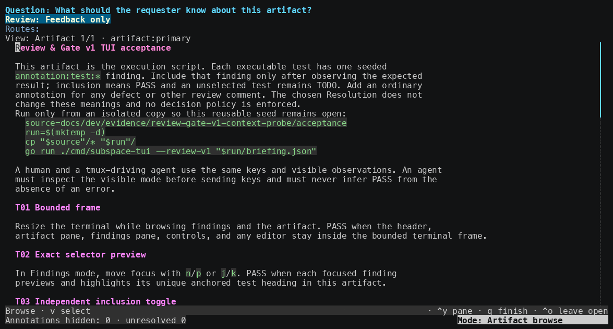
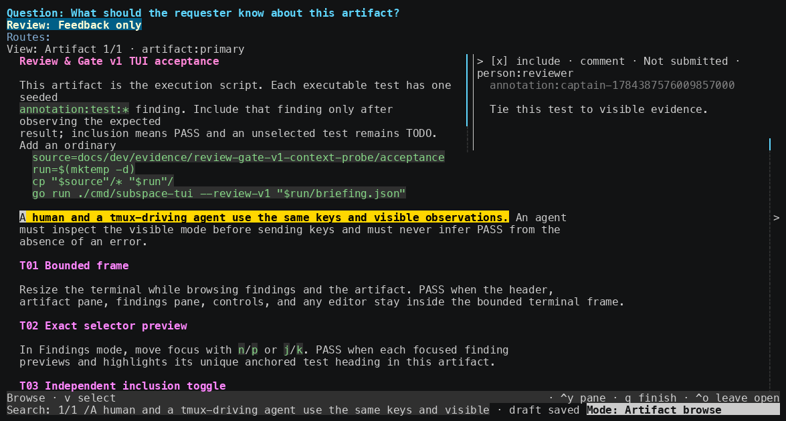

# Subspace

Review Markdown without leaving your terminal.

Subspace gives Claude Code and Codex a focused reader where you can attach
comments and suggested changes to exact text. When you finish, your decision
and feedback return to the agent that asked for the review.



## Try it in your terminal

Install the native app with Homebrew:

```sh
brew install spacedock-dev/tap/subspace-beta
```

Open any Markdown file:

```sh
subspace-tui path/to/file.md
```

Select text to leave a comment or suggest a replacement. When you are ready,
approve the document, request revisions, or leave the review open for later.



## Use it with Claude Code or Codex

The agent integration currently opens Subspace in a Zellij floating pane. It
requires Zellij 0.44.x and `jq`, in addition to the Homebrew-installed
`subspace-tui` binary above.

Choose one agent host and install the Subspace plugin.

For Claude Code:

```sh
claude plugin marketplace add spacedock-dev/marketplace
claude plugin install subspace@spacedock
```

For Codex:

```sh
codex plugin marketplace add spacedock-dev/marketplace
codex plugin add subspace@spacedock
```

Start a new agent session so the plugin loads, then ask it to review a file:

```text
# Claude Code
/subspace:r docs/design.md

# Codex
$subspace:r docs/design.md
```

Subspace opens the file in the terminal. Your comments, suggestions, and final
decision return to the same agent session when you submit the review.

## Troubleshooting

The current plugin requires `subspace-tui` version `0.10.0-beta.1`.

If the binary is missing:

```sh
brew install spacedock-dev/tap/subspace-beta
```

If an older version is installed:

```sh
brew upgrade spacedock-dev/tap/subspace-beta
```

If Homebrew is not installed, follow the instructions at
[brew.sh](https://brew.sh), then retry the appropriate command above.

## License

Apache-2.0 covers the public plugin and skill integration files in this
repository. The released `subspace-tui` binary is proprietary, and its source
code is not included.
